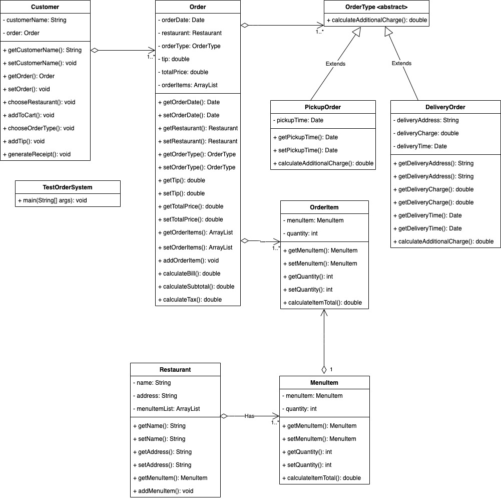

# ICS4U OOP Assignment

[*see instructions for details*](Instructions.md)

  

## Summary
The system that is being modelled is a menu ordering system. The main class, TestOrderSystem, prints out the receipt for the customer. The user is a customer that provides their name and their order. The order then consists of the order date, restaurant name, type of order (pickup/delivery), tip, total price and the order items. For either pickup or delivery, there is a time provided for both. However, in delivery, it also includes a delivery address and a flat rate charge of $5. The user is able to input the number that corresponds with the menu item, and the quantity of the item. After, the price is totalled up along with the tax and tip they provide and is delivered to their address. 